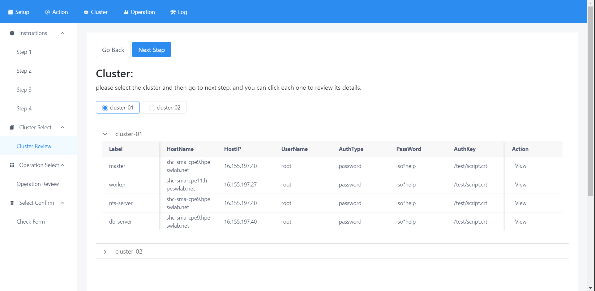
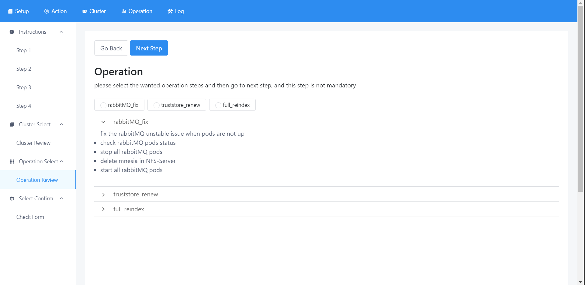
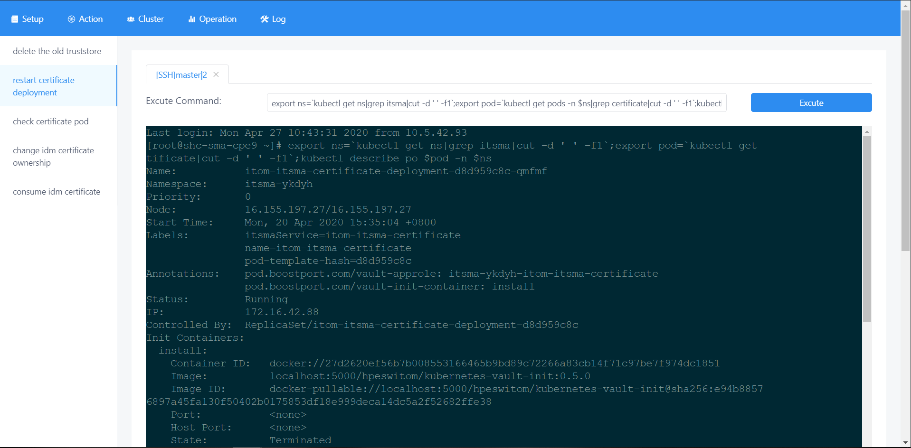

# sma_easy_helper_backend ##
### Feature ###
>
>1. it enable customer to run a series of operation to fix a amount problems;
>2. it enables customer to choose different cluster to run commands;
>3. it enable customer to import different customized operation script.
### Usage Instruction ###
>
**1.Open the first Setup page to select cluster and operation**
* customer can follow the page instruction to do the operation. you can just click the next button to move next page.
* please make sure cluster and operation choices should be made. Customer can directly navigate to the **cluster review** and **operation review** page to select the cluster and operation like below:

>
**2.After choosing the cluster and operation and go action page**
* customer shall choose the wanted cluster and operation, and then cofirm button will be activated. and all settled cluster and operation data will be rewritten in the web application. And the page will be redirected to the action page and allows customer to do operation.
>
**3.Customer can follow the left hand instruction to run operation**
* when customer click the different step, the web will promopt different tab page guiding customer to run different operations. for example, if the step is designed customer to run a Linux command in SSH terminal, there will be a SSH type tab awaked, customer can review which step should be inputed, and then run excute button to run this command like below:

>
**4.Customer can click the previous used tab for switching the tab**
>
**5.Customer can go to log tab to get your operation step**
### Package Environment Deploy ###
**1. Directly download the compiled package based on your target system (for example Linux).**
>
You can go to the release tab of this github and download the tar file based on your used environment. For example, you should download the
windows version if you want to deploy this in your environment.
> 
**2. use go build command to build the package and run it.**
>
If you would like to see the features of every functions and its data flow. please make sure the environment has installed
the golang 1.14 environment. and you can directly run go build main.go in the root directory. the go mod will directly download
the required package.
>